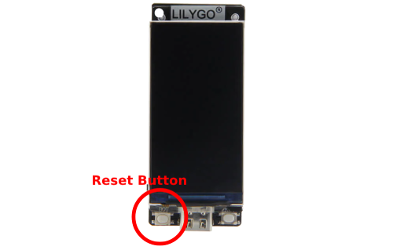
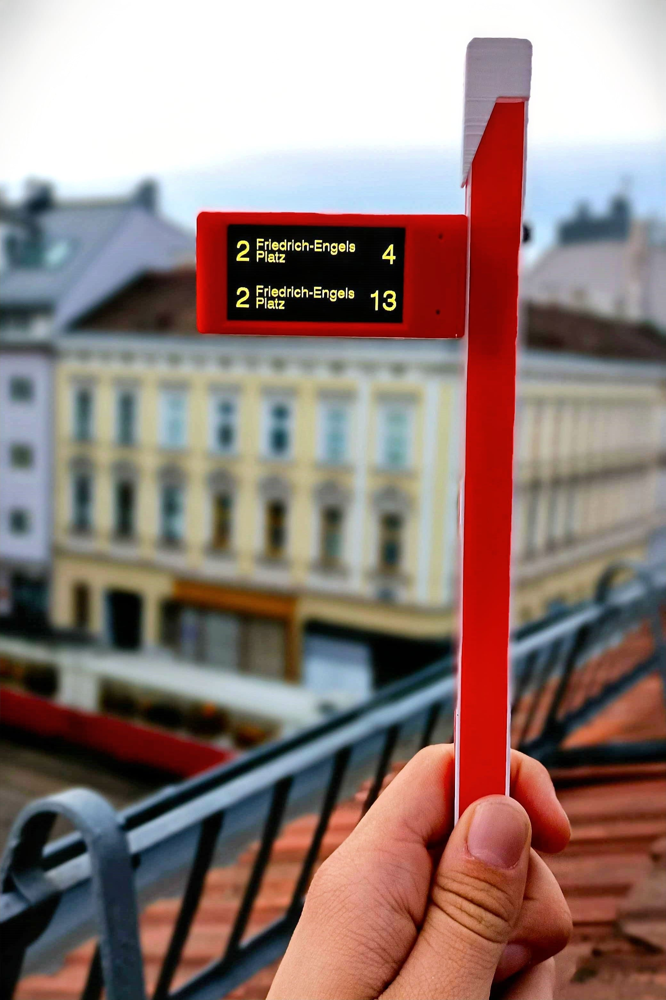

# Wiener Linien ESP32-S3 Public Transport Departure Monitor

**Brief description:** The ESP32-S3 Public Transport Departure Monitor project is a small device based on the ESP32-S3 platform. It allows you to track public transport departures in real time and receive a countdown to the next departures. The project is based on the use of open data from the City of Vienna provided by Wiener Linien. (Data source: City of Vienna - https://data.wien.gv.at)

https://github.com/coppermilk/wiener_linien_esp32_monitor/assets/25866713/15eaa64c-565c-4828-9e0d-c0c5b81a090a

## Project components:
- 1x LILYGO T-Display-S3 ESP32-S3 1.9-inch board. [[AliExpress]](https://de.aliexpress.com/item/1005004756588137.html?af=208&cv=0&cn=42s1eefrilp8reljxqmxkbskcmmy336v&dp=v5_42s1eefrilp8reljxqmxkbskcmmy336v&af=208&cv=0&cn=42s1eefrilp8reljxqmxkbskcmmy336v&dp=v5_42s1eefrilp8reljxqmxkbskcmmy336v&utm_source=epn&utm_medium=cpa&utm_campaign=208&utm_content=0&product_id=1005004756588137&afref=https%3A%2F%2Fbackit.me&aff_fcid=c8c377a14da845c7838fa62c18307494-1695404439822-03623-_9G57Xi&aff_fsk=_9G57Xi&aff_platform=portals-hotproduct&sk=_9G57Xi&aff_trace_key=c8c377a14da845c7838fa62c18307494-1695404439822-03623-_9G57Xi&terminal_id=4559c76026b7443083747fca08307839&afSmartRedirect=y)
- 1x USB cable with magnetic connector. (Little cut borders.) [[AliExpress]](https://de.aliexpress.com/item/4001058884201.html?af=208&cv=0&cn=42s1eeqlg1t78izxx05nefdc9mbc0xmk&dp=v5_42s1eeqlg1t78izxx05nefdc9mbc0xmk&af=208&cv=0&cn=42s1eeqlg1t78izxx05nefdc9mbc0xmk&dp=v5_42s1eeqlg1t78izxx05nefdc9mbc0xmk&utm_source=epn&utm_medium=cpa&utm_campaign=208&utm_content=0&product_id=4001058884201&afref=https%3A%2F%2Fbackit.me&aff_fcid=e96e9205401748eb9aa8edd56caa1a1b-1695404829888-03654-_9G57Xi&aff_fsk=_9G57Xi&aff_platform=portals-hotproduct&sk=_9G57Xi&aff_trace_key=e96e9205401748eb9aa8edd56caa1a1b-1695404829888-03654-_9G57Xi&terminal_id=4559c76026b7443083747fca08307839&afSmartRedirect=y)
- 2x M2.5 nut [[AliExpress]](https://de.aliexpress.com/item/32868834536.html?af=208&cv=0&cn=42s1eekk33drkxs90p3wbwdm24t1uubz&dp=v5_42s1eekk33drkxs90p3wbwdm24t1uubz&utm_source=epn&utm_medium=cpa&utm_campaign=208&utm_content=0&product_id=32868834536&afref=https%3A%2F%2Fbackit.me&aff_fcid=0557ee873c784873aeaec6d3a895b90d-1695404612484-05078-_vPQBRQ&tt=API&aff_fsk=_vPQBRQ&aff_platform=api-new-link-generate&sk=_vPQBRQ&aff_trace_key=0557ee873c784873aeaec6d3a895b90d-1695404612484-05078-_vPQBRQ&terminal_id=4559c76026b7443083747fca08307839&afSmartRedirect=y)
- 2x M2.5x18 bolt. [[AliExpress]](https://de.aliexpress.com/item/1005003853856791.html?af=208&cv=0&cn=42s1eenn5zlx19t4h9xmxpal5wqfbf41&dp=v5_42s1eenn5zlx19t4h9xmxpal5wqfbf41&af=208&cv=0&cn=42s1eenn5zlx19t4h9xmxpal5wqfbf41&dp=v5_42s1eenn5zlx19t4h9xmxpal5wqfbf41&utm_source=epn&utm_medium=cpa&utm_campaign=208&utm_content=0&product_id=1005003853856791&afref=https%3A%2F%2Fbackit.me&aff_fcid=791ee3d4ae5c448eb8498230bbe23f74-1695404723693-04391-_9G57Xi&aff_fsk=_9G57Xi&aff_platform=portals-hotproduct&sk=_9G57Xi&aff_trace_key=791ee3d4ae5c448eb8498230bbe23f74-1695404723693-04391-_9G57Xi&terminal_id=4559c76026b7443083747fca08307839&afSmartRedirect=y)
- Glue.
- [Details printed on a 3D printer.](https://www.thingiverse.com/thing:6166463)
- [Sketch for Arduino IDE.](https://github.com/coppermilk/wiener_linien_esp32_monitor/)

## Installation
- Install T-Display S3 in Arduino. [YouTube tutorial.](https://www.youtube.com/watch?v=gpyeMjM9cOU&ab_channel=VolosProjects)
- Clone or download this repository.
- Open the Arduino IDE and install the required libraries (TFT_eSPI, ArduinoJson, HttpClient, WiFi).
- Connect your ESP32 device to your computer.
- Change the ssid and password variables in the code to match your Wi-Fi credentials.
- Important: Update the URL variable in the code to select your specific RBL (reference bus stop). You can find your RBL [here](https://till.mabe.at/rbl/?line=102&station=4909).
- Flash the code to your ESP32.

## Configuration

## Resetting

**Factory Reset:**
- Factory reset (keep reset button pressed for more than 30 seconds) will erase all data on your device, including:
  - Wi-Fi settings
  - StopID/RBL
  - Stops filter
  - Count lines on screen

**Soft Reset:**
- Soft reset (keep reset button pressed for 5 to 10 seconds, then unpress) will only erase your Wi-Fi settings.

In other words:

- **Factory reset**: Erases everything, including Wi-Fi settings, StopID/RBL, stops filter, and count lines on the screen.
- **Soft reset**: Erases only Wi-Fi settings.

### When to Use Each Reset?

**Use a Factory Reset if:**
- You are giving away your device.
- Your device is not working properly, and you have tried other troubleshooting steps.

**Use a Soft Reset if:**
- You are having trouble connecting to Wi-Fi.
- You want to restore your Wi-Fi settings to their default values.

## Opportunities:
- Displaying the countdown to the next public transport departures.
- Updating information every 30 seconds, ensuring that the data is up to date.
- Automatic startup when booting the ESP32-S3 device.
- Authentic color design, providing ease of use.
- Based on the open data of the City of Vienna provided by Wiener Linien.

## Description:
The ESP32-S3 Public Transport Departure Monitor project is a homemade device designed to effectively track and manage the time of public transport departures. Inspired by the needs of citizens tired of endless waiting at bus stops, the project provides accurate data on the time of the next departures on selected routes.

The main goal of the project is to reduce the waiting time at bus, tram and metro stops, allowing users to know when they need to leave home to arrive at the time of departure of transport. The project is equipped with a user-friendly interface and is automatically updated every 30 seconds to provide up-to-date information about the departure time.

## Future plans:
- [ ] Add support for multiple urban transport lines to track different routes and flexible travel planning.
- [ ] Allow users to set preferences and favorite routes.
